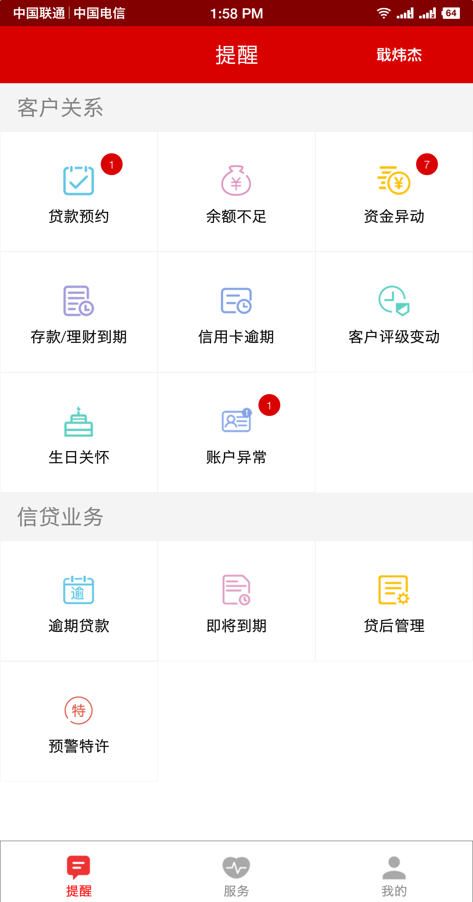
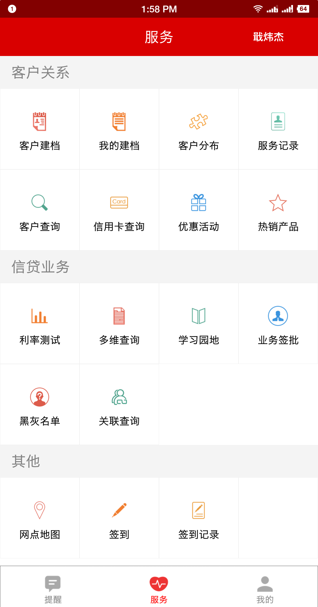
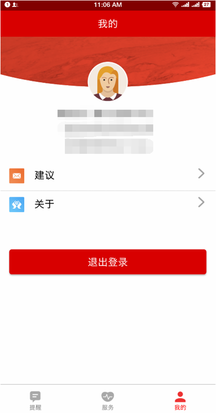

# 概况

## 简介
&emsp;&emsp;客户经理使用APP先后进行了CRM移动端的全面改版、信贷功能模块的集成等工作，通过苹果/安卓手机端及安卓选型PAD端的方式多端统一提供相关功能及服务。
截至目前，客户经理APP已经可以支持客户贷款预约、余额不足、资金异动、存款/理财/贷款到期、信用卡逾期、评级变动、生日关怀、贷款逾期、贷后管理的及时提醒；并通过模块化的方式，根据用户权限提供包括客户建档、客户查询、网点地图、厅堂管理、信用卡进件、利率测算、信贷查询、学习园地、贷款移动审批等众多功能及服务。

  

&emsp;&emsp;如图所示，APP整体划分为三大板块：提醒、服务、我的。其中提醒部分主要是重要信息的分类提示，以便于客户经理便捷查阅，及时把握工作重点，积极维护客户；服务部分集成了常用系统的常用功能，这里可以进行必要的业务新增、查询、审批等工作；我的版块则和大多数APP一样，提供关于、设置等通用基础功能。

## 登录
APP可通过扫码-浏览器打开下载：

&emsp;&emsp;用户登录账号密码与CRM（客户关系管理系统）一致。出于安全考虑，用户登录账号与手机序列号存在绑定关系，如果出现序列号相关问题导致无法登录，可联系CRM系统管理员处理。

&emsp;&emsp;由于每个功能点都有相应的细节规则，为了便于客户经理们正确使用，下文将对相关细节进行必要的介绍和常见问题答疑。

